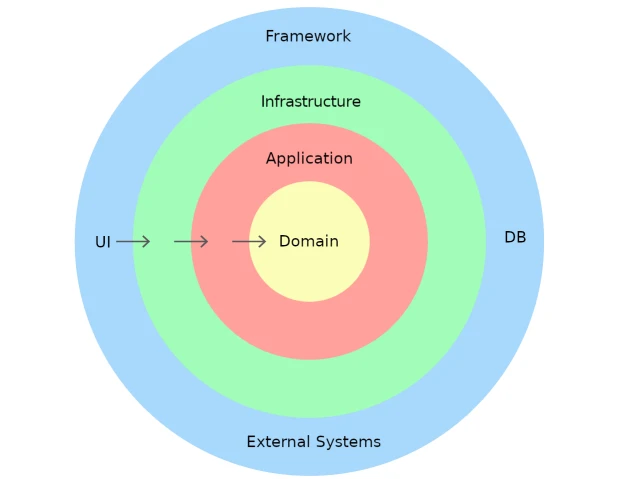

# React Vite Typescript with DDD & Hexagonal Architecture patterns
This is a React, [vite](https://vitejs.dev/) and typescript project with **DDD and Hexagonal Architecture patterns**.

The goal of this architecture patterns in front-end is to **decouple different layers** like the domain, application and infrastructure from the UI.

- The **domain layer** contains the business logic and rules that define the application's behavior. It is the layer that contains the entities, value objects, domain services, etc.
- The **application layer** contains the application's use cases such as services, commands, queries, etc. Usually is the layer that connects the UI with the domain.
- The **infrastructure layer** contains the implementation of the application's interfaces such as http repositories, external services, etc.
- The **UI layer** contains the UI and the framework (React) with all it's dependencies like the application's components, hooks, etc. This layer is the only one that depends on React.

Dependencies between layers are **inward-facing**, meaning that higher-level layers can only depend on lower-level layers:  

  

*[Image © hibit.dev](https://www.hibit.dev/posts/15/domain-driven-design-layers)*  

The benefits will be a highly scalable and maintainable application with a **clear separation of concerns** in which you can change layers without affecting the others.

Note: You probably want to adapt or add others patterns that fit your needs better. This is just an starting point and improve it is encouraged.  

## What is this not
- A complete project with all the patterns you'll need
- A showcase of OOP, dependency injection (DI) or inversion of control (IoC)
- A showcase of how unit test the different layers

## What is this
- A showcase of how to structure and scale React applications using DDD and Hexagonal Architecture patterns
- A showcase of how to use context and useReducer to manage react state
- A showcase of how to use React Router

## How to run it
1. Clone the repository
2. Run `npm install`
3. Run `npm run dev`

